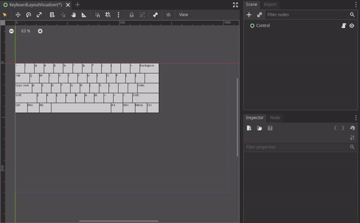

# InputVisualizer

Visualize input such as keyboard key, mouse, game-pad, etc... for Godot

> Currently this is just a proof of concept, I may or may not continue working on it in the future. Feel free to fork it & work on your own implementation if you find the idea interesting(Do share with me if you happen to finish it =) ).

## TODO

- Basic
  - KeyboardRenderer
    - [x] Port parser from [kle-serial](https://github.com/ijprest/kle-serial)
    - [x] Draw keyboard with .json file export from [keyboard-layout-editor](http://www.keyboard-layout-editor.com)(not fully done yet, special key shape & rotation not implemented)
      - [ ] Each key should be drawn as individual `Button`, so they can be redrawn individually
    - [ ] Interactable, handle mouse clicks & reflect key press(Need to figure out how to map input key onto keyboard layout, since [kle](https://github.com/ijprest/kle-serial#keys) only store key label instead of scancode)
  - [ ] Mapping input directly on virtual keyboard rendered by KeyboardRenderer(in editor)
  - [ ] InputKeyOverlay, to display key pressed on screen, useful for debug in game/editor
- Advance
  - [ ] MouseRenderer
  - [ ] GamepadRenderer
